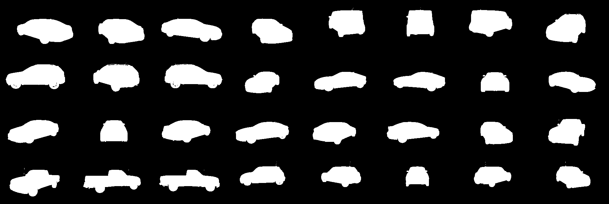
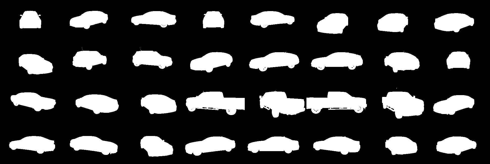
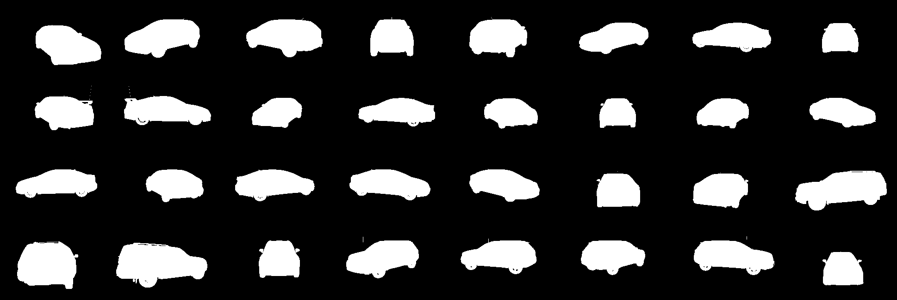

# UNet Segmentation Model for Carvana Image Masking Challenge

## Overview
This project implements a UNet model for image segmentation, specifically for the [Carvana Image Masking Challenge](https://www.kaggle.com/c/carvana-image-masking-challenge). The goal is to accurately segment car images to generate precise masks for each vehicle.

### Key Metrics
- **Dice Score**: 0.99336
- **Loss**: 0.00688
- **Accuracy**: 99.754%

## Dataset
The dataset used for this project is from the [Carvana Image Masking Challenge](https://www.kaggle.com/c/carvana-image-masking-challenge). It consists of high-resolution car images and their corresponding binary masks.

## Model Architecture
The UNet model is a convolutional neural network (CNN) designed for biomedical image segmentation. Its architecture is symmetric and consists of two main parts:

1. **Contracting Path (Encoder)**:
   - Sequential convolutional layers with ReLU activation.
   - Downsampling using max-pooling to capture context and reduce spatial dimensions.

2. **Expanding Path (Decoder)**:
   - Transposed convolution layers for upsampling.
   - Skip connections to concatenate feature maps from the encoder to the decoder.
   - Final convolutional layer to produce the segmentation mask.

### Detailed Architecture
- **Input**: 3-channel RGB image.
- **Output**: Single-channel binary mask.
- **Layers**:
  - Double Convolution: Two convolutional layers with ReLU activation and Batch Normalization.
  - Downsampling: MaxPooling layers in the encoder.
  - Upsampling: Transposed convolutions in the decoder.
  - Skip Connections: Feature maps from the encoder are concatenated with the decoder layers to retain spatial information.

**Architecture Diagram**


## Training Details
- **Optimizer**: Adam
- **Learning Rate**: 1e-4
- **Loss Function**: Binary Cross-Entropy with Logits Loss
- **Batch Size**: 32
- **Epochs**: 100
- **Augmentations**:
  - Rotation
  - Horizontal Flip
  - Vertical Flip
  - Normalization

## Results
Below are some examples of the segmentation results:





## How to Use
### Prerequisites
- Python 3.8+
- PyTorch
- Albumentations
- tqdm

### Steps
1. Clone the repository:
   ```bash
   git clone https://github.com/Monish-KS/UNet_Implementation.git
   ```
2. Install dependencies:
   ```bash
   pip install -r requirements.txt
   ```
3. Prepare the dataset:
   - Download the dataset from [Kaggle](https://www.kaggle.com/c/carvana-image-masking-challenge).
   - Place the images and masks in the `data/train_images/` and `data/train_masks/` directories, respectively.
   - Create another set of folders representing the validation set in the `data/val_images` and `data/val_masks` directories, respectively.

4. Train the model:
   ```bash
   python train.py
   ```
5. Evaluate the model:
   ```bash
   python test.py
   ```

## Files and Directories
- `model.py`: Defines the UNet architecture.
- `train.py`: Script for training the model.
- `utils.py`: Utility functions for data loading, saving predictions, and evaluation.
- `data/`: Directory for training and validation data.
- `saved_images/`: Directory for saving predicted masks.

## Future Work
- Add more augmentations to improve generalization.
- Experiment with different loss functions and optimizers.
- Visualize training metrics like loss and accuracy over epochs.

## Acknowledgments
- [Carvana Image Masking Challenge](https://www.kaggle.com/c/carvana-image-masking-challenge) for the dataset.
- [PyTorch](https://pytorch.org/) for the deep learning framework.
- [Albumentations](https://albumentations.ai/) for data augmentation.

## License
This project is licensed under the MIT License. See the `LICENSE` file for details.

---
Feel free to contribute or raise issues for improvements!

